<div align="center">
  <p></p>
  
  
  
</div>

## 目录

- [邮箱](#邮箱)
- [电话](#电话)
- [域名](#域名)
- [IP](#ip)
- [帐号校验](#帐号校验)
- [字符校验](#字符校验)
  - [汉字](#汉字)
  - [英文和数字](#英文和数字)
  - [长度为3-20的所有字符](#长度为3-20的所有字符)
  - [英文字符](#由英文字符)
    - [由26个英文字母组成的字符串](#由26个英文字母组成的字符串)
    - [由26个大写英文字母组成的字符串](#由26个大写英文字母组成的字符串)
    - [由26个小写英文字母组成的字符串](#由26个小写英文字母组成的字符串)
    - [由数字和26个英文字母组成的字符串](#由数字和26个英文字母组成的字符串)
    - [由数字、26个英文字母或者下划线组成的字符串](#由数字26个英文字母或者下划线组成的字符串)
  - [中文、英文、数字包括下划线](#中文英文数字包括下划线)
  - [中文、英文、数字但不包括下划线等符号](#中文英文数字但不包括下划线等符号)
  - [禁止输入含有^%&',;=?$\"等字符](#禁止输入含有等字符)
  - [禁止输入含有~的字符](#禁止输入含有的字符)
- [数字正则](#数字正则)
  - [整数](#整数)
    - [正整数](#正整数)
    - [负整数](#负整数)
    - [非负整数](#非负整数)
    - [非正整数](#非正整数)
  - [浮点数](#浮点数)
    - [正浮点数](#正浮点数)
    - [负浮点数](#负浮点数)
    - [非负浮点数](#非负浮点数)
    - [非正浮点数](#非正浮点数)

## 邮箱

`gaozihang-001@gmail.com` 只允许英文字母、数字、下划线、英文句号、以及中划线组成

```regex
^[a-zA-Z0-9_-]+@[a-zA-Z0-9_-]+(\.[a-zA-Z0-9_-]+)+$
```


`高子航001Abc@bowbee.com.cn` 名称允许汉字、字母、数字，域名只允许英文域名

```regex
^[A-Za-z0-9\u4e00-\u9fa5]+@[a-zA-Z0-9_-]+(\.[a-zA-Z0-9_-]+)+$
```

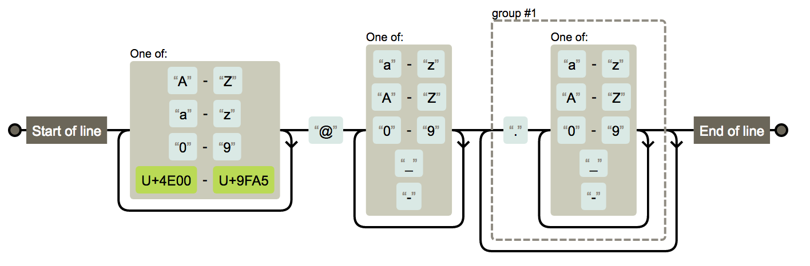

## 电话

`13012345678` 手机号

```regex
^1(3|4|5|6|7|8|9)\d{9}$
```

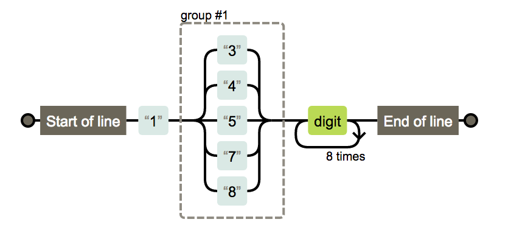

`XXX-XXXXXXX` `XXXX-XXXXXXXX` 固定电话

```regex
(\(\d{3,4}\)|\d{3,4}-|\s)?\d{8}
```

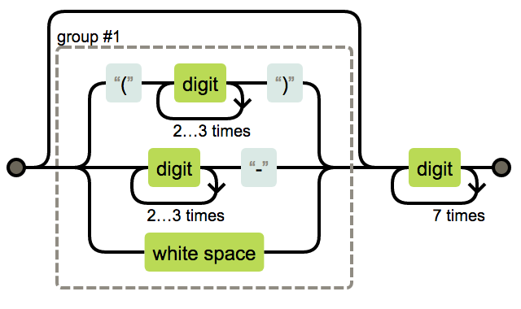

## 域名

`https://google.com/`

```regex
^((http:\/\/)|(https:\/\/))?([a-zA-Z0-9]([a-zA-Z0-9\-]{0,61}[a-zA-Z0-9])?\.)+[a-zA-Z]{2,6}(\/)
```

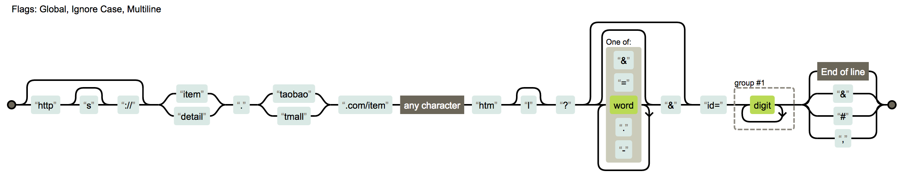

## IP

`127.0.0.1`

```regex
((?:(?:25[0-5]|2[0-4]\d|[01]?\d?\d)\.){3}(?:25[0-5]|2[0-4]\d|[01]?\d?\d))
```

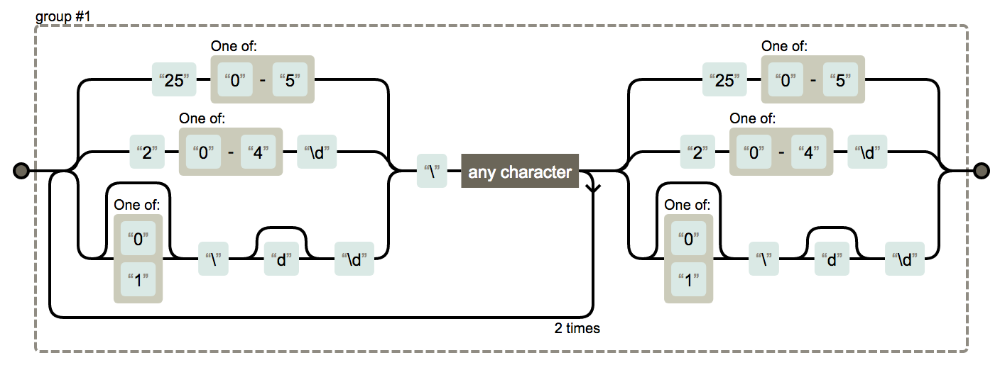

## 帐号校验

`gaozihang_001` 字母开头，允许5-16字节，允许字母数字下划线

```regex
^[a-zA-Z][a-zA-Z0-9_]{4,15}$
```

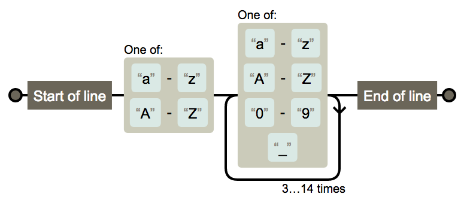

## 字符校验

### 汉字

`高子航`

```regex
^[\u4e00-\u9fa5]{0,}$
```

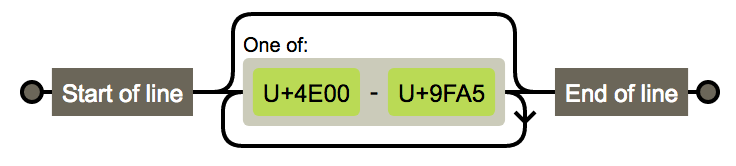

### 英文和数字

```regex
^[A-Za-z0-9]+$
```

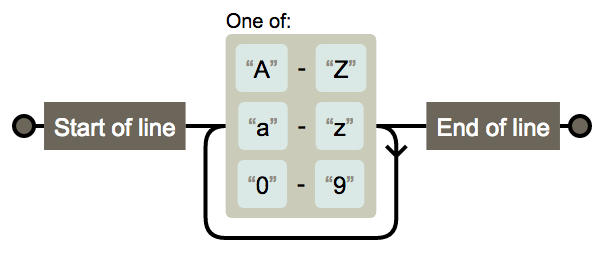

### 长度为3-20的所有字符

```regex
^.{3,20}$
```

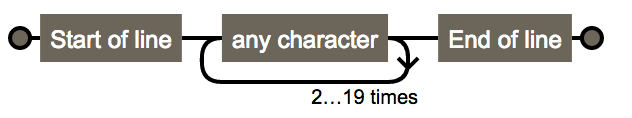

### 英文字符

#### 由26个英文字母组成的字符串

```regex
^[A-Za-z]+$
```

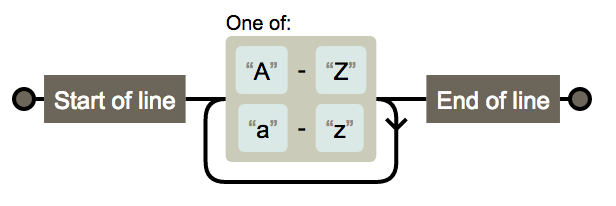

#### 由26个大写英文字母组成的字符串

```regex
^[A-Z]+$
```

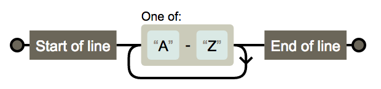

#### 由26个小写英文字母组成的字符串

```regex
^[a-z]+$
```

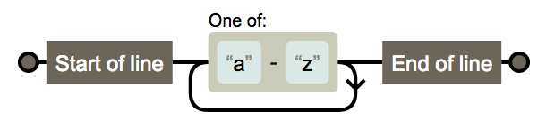

#### 由数字和26个英文字母组成的字符串

```regex
^[A-Za-z0-9]+$
```

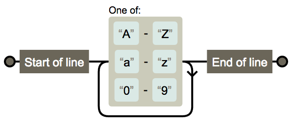

#### 由数字、26个英文字母或者下划线组成的字符串 

```regex
^\w+$
```

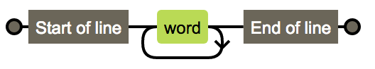

### 中文、英文、数字包括下划线

```regex
^[\u4E00-\u9FA5A-Za-z0-9_]+$
```

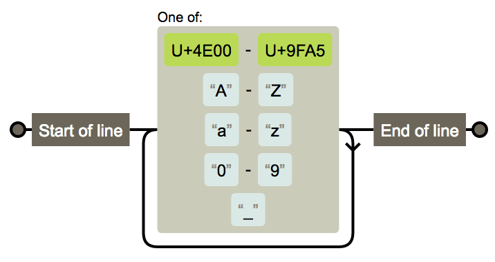

### 中文、英文、数字但不包括下划线等符号

```regex
^[\u4E00-\u9FA5A-Za-z0-9]+$
```

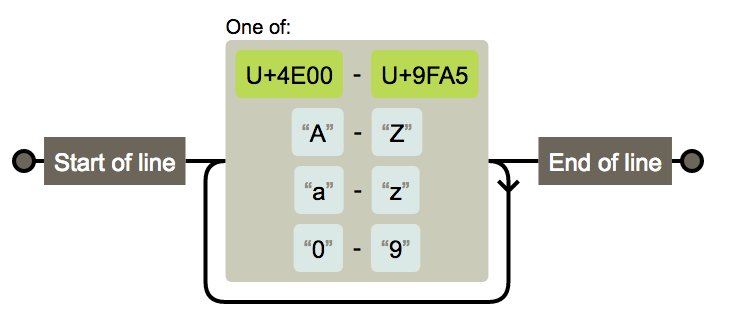

### 禁止输入含有%&',;=?$\"等字符

```regex
[^%&',;=?$\x22]+
```

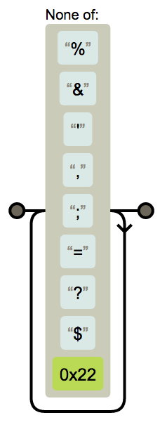

### 禁止输入含有~的字符

```regex
[^~\x22]+
```

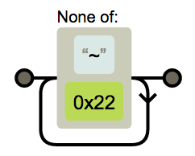

## 数字正则

### 整数

```regex
^-?[1-9]\d*$
```

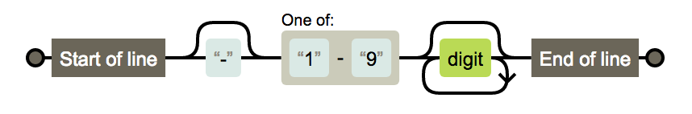

#### 正整数

```regex
^[1-9]\d*$
```

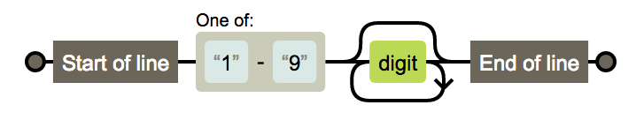

#### 负整数

```regex
^-[1-9]\d*$
```

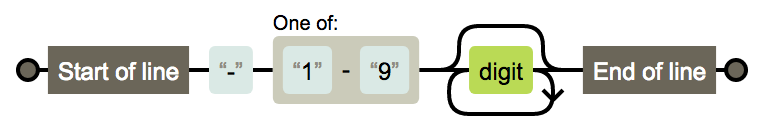

#### 非负整数

```regex
^[1-9]\d*|0$
```

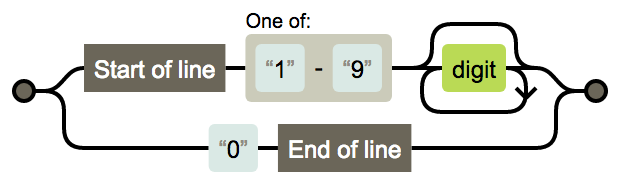

#### 非正整数

```regex
^-[1-9]\d*|0$
```

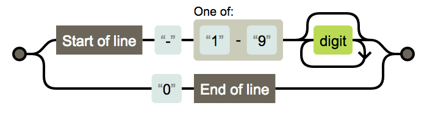

### 浮点数

```regex
^-?([1-9]\d*\.\d*|0\.\d*[1-9]\d*|0?\.0+|0)$
```

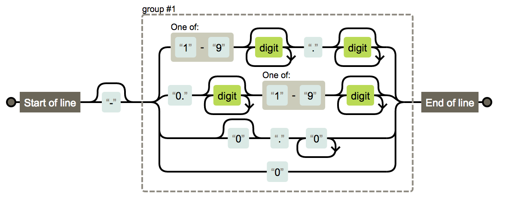

#### 正浮点数

```regex
^[1-9]\d*\.\d*|0\.\d*[1-9]\d*$
```

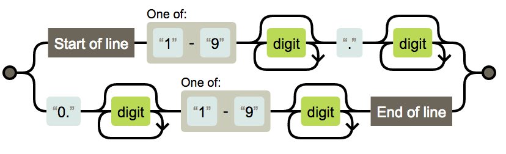

#### 负浮点数

```regex
^-([1-9]\d*\.\d*|0\.\d*[1-9]\d*)$
```


#### 非负浮点数

```regex
^[1-9]\d*\.\d*|0\.\d*[1-9]\d*|0?\.0+|0$
```

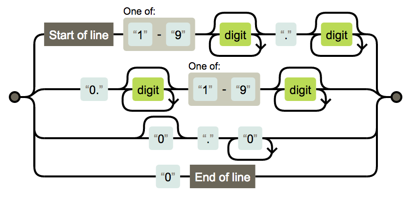

#### 非正浮点数

```regex
^(-([1-9]\d*\.\d*|0\.\d*[1-9]\d*))|0?\.0+|0$
```

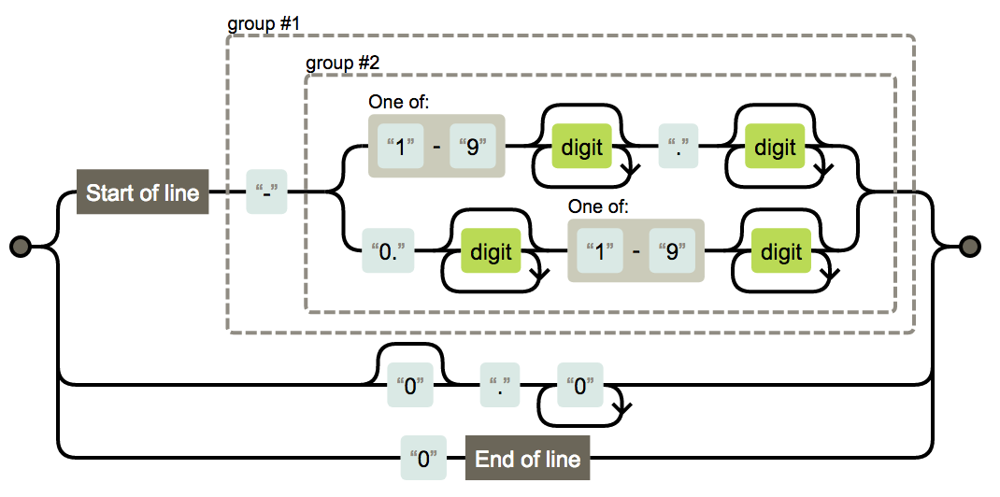

## License

MIT License. See the [LICENSE](LICENSE) file.

**[⬆ top](#目录)**
